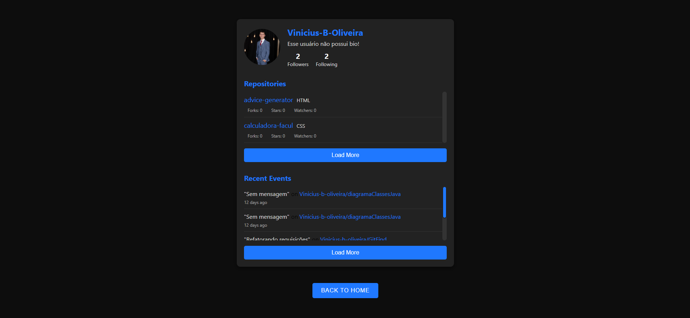
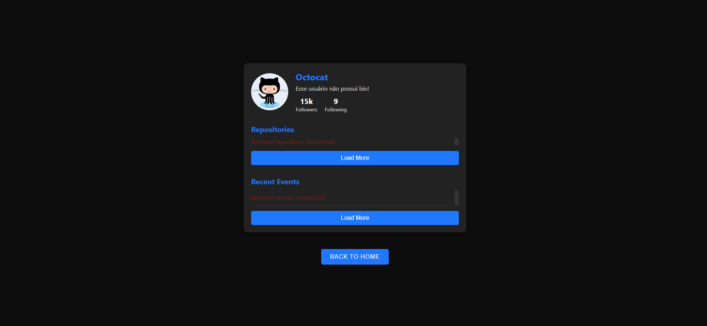

# 👉 gitFind 👈

🚀 Bem-vindo ao **gitFind**! Meu nome é Vinicius Bueno e este é um projeto que desenvolvi para praticar meus conhecimentos em programação. A aplicação permite que você busque usuários pelo nome no GitHub e obtenha detalhes como foto de perfil, biografia, repositórios e eventos relacionados.

## 📜 Sobre o Projeto 📜

O **gitFind** utiliza a API do GitHub para buscar e exibir informações detalhadas sobre usuários. Com ele, você pode explorar os repositórios públicos, eventos recentes, bio, e muito mais. O principal objetivo deste projeto foi reforçar habilidades em ReactJS, requisições com axios e manipulação de rotas com react-router-dom.

## 🚧 Desafios Enfrentados 🚧

Durante o desenvolvimento, um dos principais desafios foi a integração com a API do GitHub e o tratamento de erros durante as requisições, além da implementação do roteamento dinâmico para navegar entre as páginas. Adaptar o uso do axios para lidar com as requisições de forma otimizada também exigiu atenção.

## 📸 Visuais 📸

Confira abaixo alguns visuais da aplicação:

|  |  |
|:---:|:---:|
|  |  |

## 🌐 Tecnologias Utilizadas

As principais tecnologias usadas no **gitFind** foram:

- **ReactJS** para a construção da interface
- **axios** para realizar requisições HTTP à API do GitHub
- **react-router-dom** para o gerenciamento de rotas
- **Lucide** para a exibição de ícones
- **CSS** para a estilização da aplicação

## 🏃‍♂️ Como Executar o Projeto 🏃‍♀️

Para executar o projeto localmente, siga os passos abaixo:

1. Clone este repositório: `git clone https://github.com/Vinicius-b-oliveira/GitFind.git`
2. Navegue até a pasta do projeto: `cd GitFind`
3. Instale as dependências: `npm install`
4. Execute o projeto: `npm run dev`
5. Acesse a aplicação no navegador através do link fornecido pelo terminal

## 🤝 Contribuição 🤝

Sinta-se à vontade para abrir issues ou enviar pull requests com sugestões de melhorias. Qualquer contribuição será muito bem-vinda!
